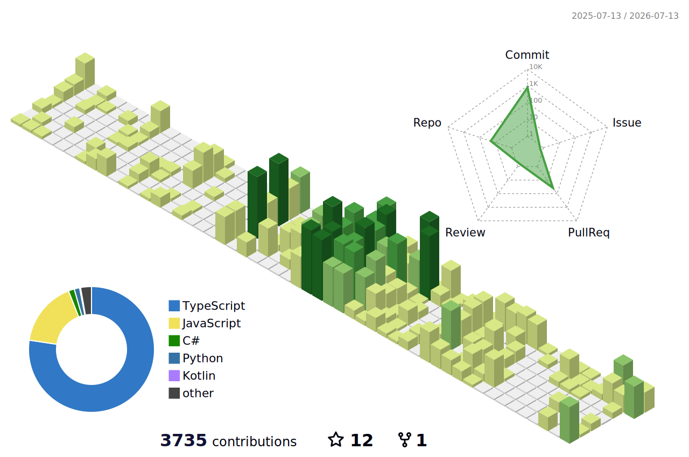

# Hi, there 👋 

こんにちは、開発歴6年の高校生エンジニア、[イ・ジュンソン](https://junx.dev/)です！

## 🌐 If you need another language?
한국어 (ko) | [English (en)](/README-en.md) | [日本語 (ja)](/README-ja.md) | [中文 (zh)](/README-zh.md) | [Español (es)](/README-es.md) | [Français (fr)](/README-fr.md) | [Deutsch (de)](/README-de.md) | [Русский (ru)](/README-ru.md) | [Português (pt)](/README-pt.md)

## 🛠️ Skills

'

